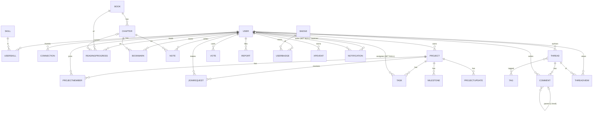

# Colearn → Supabase: Full Technical Analysis and Migration Plan

| | |
|---|---|
| **Date** | 2026-09-19 |
| **Status** | Analysis only. Nothing has been changed, created, deleted or committed. Django stays untouched. |
| **Scope inspected** | `backend/` (Django 4.2 + DRF), `CoLearner/` (React + Vite), config, migrations, tests, seed command, and the real `backend/db.sqlite3` (opened read-only). |
| **Method** | Every statement below comes from reading the code. Anything that is a *recommendation* or an *open decision* is labelled as such. Anything I could not verify from the repo is flagged "verify". |

---

## 0. Executive summary

**What Colearn is.** A learning + collaboration platform ("Learn → Build → Prove"): a curated book library with a chapter reader, project teams with a task board, a community forum, a people directory with connections, and a gamification layer (XP, levels, streaks, badges, leaderboard). It has an in-app admin area for staff.

**What the backend really is.** 7 Django apps, 26 models, 68 URL patterns, and 250 tests. It is mostly CRUD plus three pieces of real logic:

1. **Gamification engine** (`gamification/services.py`): XP ledger, level formula, 15 badge rules, streaks, daily caps. It is called from almost every write path.
2. **State machines** in `projects/views.py` (join, invite, approve, leave, capacity) and `users/views.py` (connections).
3. **Read models**: aggregate queries for dashboard, leaderboard, search, portfolio, and the per-viewer flags on lists (progress, vote, connection status).

**Verified absences (these simplify the migration):** no Django signals, no Celery or background jobs, no WebSockets, no custom middleware, no custom permission classes, no AI or LLM calls, no payments, no third-party HTTP APIs. The only external service is SMTP (password-reset email). The `redis` service in `docker-compose.yml` is not used by any code.

**Can Supabase fully replace Django?** Yes.

| Django responsibility | Supabase replacement |
|---|---|
| Auth (SimpleJWT, password hashing, reset) | Supabase Auth |
| 26 models / SQLite→Postgres | 27 Postgres tables (26 models + 1 M2M). Same shape, typed FKs instead of Django `GenericForeignKey`. |
| DRF permissions | RLS policies + column-level grants + helper functions |
| CRUD endpoints | PostgREST (`supabase-js .from()`) |
| Multi-step business logic and aggregate reads | Postgres functions (`SECURITY DEFINER` RPCs) and triggers |
| ImageField uploads | Storage buckets with policies |
| Django admin | Existing in-app admin (RLS + RPCs) plus Supabase Studio for everything else |
| Things Postgres cannot do | **3 Edge Functions**: `admin-users`, `delete-account`, `contact` (+1 optional) |

**Biggest risks (details in §18):** faithfully porting the XP/badge engine; the auth behaviour changes (password hashes cannot be imported, email-confirmation default, reset-link flow); user IDs change from integers to UUIDs; `SECURITY DEFINER` function and RLS hygiene.

**Decisions I need from you before any build starts:** see §21 (8 items, each with my recommended default).

---

## 1. Current architecture

```
Browser (React 18 SPA, Vite, Tailwind, Zustand, react-router 7, axios)
   │  HTTPS JSON   Authorization: Bearer <access JWT>
   │  multipart/form-data for image uploads
   ▼
Django 4.2 + Django REST Framework  (/api/v1/…)
   ├─ Auth: SimpleJWT (access 30 min, refresh 7 d, rotation + blacklist)
   ├─ Throttling (anon 300/min, user 600/min, auth 30/min, contact 10/h)
   ├─ Custom exception handler → {"error":{code,message,fields}}
   ├─ 7 apps: core, users, books, projects, community, gamification, notifications
   ├─ /admin/ (Django admin)   /api/docs (Swagger via drf-spectacular)
   ▼
SQLite (dev, committed to git) / PostgreSQL 16 (prod, docker-compose)
Local disk: backend/media/{avatars,books/covers,projects/covers}/
SMTP: password-reset email (console backend in dev)
```

| Layer | Tech (verified) |
|---|---|
| Frontend | React 18.3, Vite 8, Tailwind 3.4, Zustand 5, react-router-dom 7, axios 1.x, react-hook-form + zod, recharts, lucide-react, `@tanstack/react-query` (provider mounted but **no page uses it**) |
| Backend | Django 4.2.30, DRF 3.17, SimpleJWT 5.5, django-cors-headers, django-filter, drf-spectacular, Pillow, psycopg2-binary, python-decouple |
| Data | SQLite in dev, PostgreSQL in prod |
| Deploy artefacts | `Dockerfile` (runserver), `docker-compose.yml` (db, redis (unused), web). The README states production needs a real WSGI server, reverse proxy, static and media hosting. None of that is in the repo. |
| Tests | 250 pytest tests in `backend/tests/` and per-app `tests.py`. They are the best behavioural spec available. |

**Data flow rule that matters for the migration:** *all* HTTP goes through one file, `CoLearner/src/services/api.js`, which uses one axios instance in `services/client.js`. I searched the whole frontend for `axios`, `fetch(`, `XMLHttpRequest`, and `import.meta.env`; nothing outside those two files talks to the backend. That makes the frontend migration contained.

---

## 2. All features discovered

### Public
- Landing, How it works, Features, Our community, About (static marketing), Pricing (static; no payment code), Contact form → `POST /contact/`
- Legal, blog, careers, changelog routes are placeholder stubs
- Public profile / portfolio page `/u/:username` (works without login)

### Accounts
- Signup with live username-availability check, login, logout, session refresh, forgot/reset password
- 4-step onboarding: role, skills, interests, profile fields, avatar → +50 XP once
- Settings: edit profile and avatar, replace skill list, change password (signs out other devices), delete account (requires password)

### People
- Directory with filters (skills = AND, role, availability, location, text) and ordering (newest / xp / best_match by shared skills)
- Suggested people (top 4 by shared skills)
- Connections: send / accept (receiver only) / cancel (withdraw, decline, disconnect)
- Portfolio: skills, projects, badges, completed books, 12-week activity heatmap, stats

### Library
- Catalog (category, difficulty, tags, search, ordering by popularity), book detail with chapters and "related"
- Reader with chapter content, per-chapter completion, "continue reading" pointer, bookmark toggle, private notes
- Server-derived progress: book % from completed chapters; book completion pays XP once

### Projects
- List and filters (status, category, tech = has ALL, looking-for-members, mine, ordering)
- Create with cover; private/public; team capacity (`max_members`)
- Detail page (members, milestones, updates visible to anyone who can see the project; tasks only to members)
- Workspace: Kanban tasks, milestones, updates feed, team management, invites, join requests, role changes, leave/remove
- Invite ↔ join-request state machine with notifications; per-day XP caps

### Community
- Threads (5 categories, tags, search, sort, mine, answered), comments with one level of replies, votes (+1/−1/0 toggle) on threads and comments
- @mentions notify, "helpful comment" XP at score ≥ 5, once per day per user view counting
- Report thread/comment; staff and authors can delete

### Gamification and notifications
- XP ledger, level = `floor(sqrt(xp/50)) + 1`, daily streak and weekly bonus, 15 badges with progress, leaderboard (week / month / all-time, role filter, own row with real rank)
- Dashboard (stats, resume reading, recent XP, badges, 7-day XP chart)
- Notifications (bell, list, unread count polled every 60 s, mark one/all read)
- Global search across books, projects, people, threads

### Staff admin (in-app, `is_staff` only)
- Overview stats; users (list, create, role, ban/unban, delete); books + chapters + cover; projects moderation (status, visibility, delete); reports queue (review / resolve / dismiss / reopen / remove content / deactivate user)

### Django-admin-only (no React UI)
`ContactMessage` inbox, Skill / Tag / Badge management, pinning threads, viewing XPEvent / UserBadge / Notification / Vote / ThreadView, inline editing of tasks and members. These need a home after Django is gone (see §18, §21).

### Unused by the SPA (do not need to be ported)
`auth.getUser`, `books.getMyLibrary` (`/me/library/`), `game.getXpHistory` (`/me/xp-history/`), `/badges/` (public list), `/health/`, `GET /tasks/<id>/`, `GET /projects/<slug>/{tasks,milestones,updates}/` (the detail response embeds them), `GET /books/<slug>/chapters/`, `PATCH /admin/projects/` (list-level; the UI uses the slug route).

---

## 3. Django apps

| App | Responsibility | Models | Notes |
|---|---|---|---|
| `core` | Shared abstract models, contact form, reports, dashboard, search, seed command | `ContactMessage`, `Report` (+ abstract `TimeStampedModel`, `SlugModel`) | `SlugModel.save()` auto-generates a unique slug with `-2`, `-3`… suffixes. `Report` uses a `GenericForeignKey`. |
| `users` | Custom user, auth endpoints, profiles, skills, connections, staff admin API | `CustomUser`, `Skill`, `UserSkill`, `Connection` | `admin_api.py` (657 lines) holds the whole staff API. Login is by **email**; `username` is public. |
| `books` | Library | `Book`, `Chapter`, `ReadingProgress`, `Bookmark`, `Note` | Progress is server-derived; the client never sends a percentage. |
| `projects` | Teams and workspace | `Project`, `ProjectMember`, `JoinRequest`, `Task`, `Milestone`, `ProjectUpdate` | Most permission logic in the codebase; daily XP caps. |
| `community` | Forum | `Thread`, `Comment`, `Vote`, `Tag`, `ThreadView` (+ `Thread.tags` M2M) | `Vote` uses a `GenericForeignKey`. Mentions parsed with `@([A-Za-z0-9_.\-]+)`. |
| `gamification` | XP, badges | `Badge`, `UserBadge`, `XPEvent` | `services.py` = the engine. Migration `0002` seeds 15 badges. |
| `notifications` | In-app notifications | `Notification` | `Notification` uses a `GenericForeignKey`; `services.create_notification()` is the only writer. |
| `colearn` (project) | Settings (`base/dev/prod`), URLs, WSGI/ASGI | none | No custom middleware. Standard security/CORS/CSRF/session middleware only. |

**Cross-cutting pieces**
- `core/exceptions.py`: normalises every error to `{"error":{"code","message","fields":{}}}`; converts `Http404` to 404 without leaking model names.
- `core/throttles.py`, `users/throttles.py`: per-IP throttles for the contact form and credential endpoints.
- `core/validators.py`: image size and extension limits (avatar 2 MB, cover 5 MB; jpg/jpeg/png/webp).
- `core/management/commands/seed_demo.py` (406 lines): 30 skills, 14 users, 10 books × 5 chapters, 9 projects, 12 threads, votes, reports, connections.
- **Permissions used:** only DRF built-ins (`AllowAny`, `IsAuthenticated`, `IsAuthenticatedOrReadOnly`, `IsAdminUser`) plus inline checks. I searched for `BasePermission` and found none.
- **Signals / background jobs / middleware:** none, verified with grep.

---

## 4. Database / models

### 4.1 Django models (as implemented)

Type shorthand: `str(n)` = CharField(max n); `uint` = PositiveInteger; every model inherits `created_at` (auto_now_add) and `updated_at` (auto_now) from `TimeStampedModel` unless noted. Default PK is `BigAutoField`.

| Model (table) | Fields | Constraints / indexes |
|---|---|---|
| **CustomUser** (`users_customuser`) | `email` (unique), `username` str(150) unique, `full_name` str(150), `avatar` image→`avatars/`, `bio` text, `headline` str(200), `role` (learner\|builder\|mentor\|admin, default learner), `location` str(100), `github`/`linkedin`/`website` URL(200), `availability` str(50), `interests` JSON list, `xp` uint=0, `level` uint=1, `streak_days` uint=0, `last_active` dt null, `is_verified` bool, `onboarding_completed` bool. Inherited: `password`, `last_login`, `is_superuser`, `is_staff`, `is_active`, `date_joined`, `first_name`/`last_name` (unused), `groups`, `user_permissions` | Login field = email. Ordering: email. |
| **Skill** | `slug` (unique), `name` str(100), `category` str(50) | `name` is **not** DB-unique; case-insensitive uniqueness is enforced in code (`get_or_create_skill`) |
| **UserSkill** | `user` FK, `skill` FK, `level` (beginner\|intermediate\|advanced), `is_verified` | unique (user, skill) |
| **Connection** | `from_user` FK, `to_user` FK, `status` (pending\|accepted\|blocked) | unique (from_user, to_user). `blocked` is never written by any code path. |
| **Book** | `slug` unique, `title` str(200), `author` str(150), `description` text, `cover` image→`books/covers/`, `category` str(50), `difficulty` (beginner\|intermediate\|advanced), `tags` JSON, `est_minutes` uint, `total_pages` uint, `published_at` dt null, `is_featured` | idx (category, difficulty). `total_pages` and `published_at` are written but **never read** by any serializer or UI. |
| **Chapter** | `book` FK, `slug` **globally** unique, `title` str(200), `chapter_number` uint, `content` text | unique (book, chapter_number) |
| **ReadingProgress** | `user` FK, `book` FK, `chapter` FK null (CASCADE), `progress_percent` uint, `completed`, `completed_chapters` JSON list of ids, `book_completion_awarded`, `last_read_at` null | unique (user, book) |
| **Bookmark** | `user`, `book`, `chapter` (null), `page` uint=1, `note` text | unique (user, book, chapter, page); the API always sets `chapter` and toggles per (user, chapter) |
| **Note** | `user`, `chapter`, `content` text | idx (chapter, created_at) |
| **Project** | `slug` unique, `owner` FK, `title` str(200), `summary` str(255), `description` text, `category` str(50), `tech_stack` JSON, `looking_for_roles` JSON, `cover` image→`projects/covers/`, `status` (idea\|active\|completed\|archived), `max_members` uint=5, `is_public`=True | idx (status, created_at) |
| **ProjectMember** | `project`, `user`, `role` (owner\|member\|mentor), `joined_at` | unique (project, user) |
| **JoinRequest** | `project`, `user`, `message` text, `status` (pending\|invited\|approved\|rejected) | unique (project, user) |
| **Task** | `project`, `assignee` FK null (SET_NULL), `title` str(200), `description`, `status` (todo\|in_progress\|review\|done), `priority` (low\|medium\|high\|urgent), `due_date` null, `order` uint, `xp_awarded` bool | idx (project, status) |
| **Milestone** | `project`, `title`, `description`, `due_date` null, `status` (planned\|in_progress\|done) | |
| **ProjectUpdate** | `project`, `author`, `body` text | |
| **Thread** | `slug` unique, `author`, `title` str(200), `body` text, `category` (frontend\|backend\|product\|career\|community), `is_pinned`, `views` uint, `tags` M2M→Tag | ordering: pinned first, newest |
| **Comment** | `thread`, `author`, `parent` FK self null, `body` text, `xp_awarded` | |
| **Vote** | `user`, `value` (+1\|−1), **generic** (`content_type`, `object_id`) | unique (user, content_type, object_id). Only ever targets Thread or Comment. |
| **Tag** | `slug` unique, `name` str(50) **unique**, `color` str(20)='#2E78E5' | |
| **ThreadView** | `thread`, `user`, `viewed_on` date | unique (thread, user, viewed_on) |
| **Report** | `reporter` FK, **generic** (`content_type`, `object_id`), `reason` str(255), `status` (open\|review\|resolved\|dismissed) | The API accepts thread or comment; the admin API also handles **user** targets |
| **ContactMessage** | `name` str(120), `email`, `subject` str(200), `message` text, `is_resolved` | |
| **Badge** | `slug` unique, `name` str(100), `description`, `criteria_key` str(100), `xp_reward` uint, `icon` str(50)='award' | Badge thresholds and categories live in **code** (`BADGE_THRESHOLDS`, `BADGE_CATEGORIES`), not the table |
| **UserBadge** | `user`, `badge`, `earned_at` | unique (user, badge) |
| **XPEvent** | `user`, `amount` int, `reason` str(100), `source` str(100) | Uniqueness of (user, reason, source) is enforced **in code only** |
| **Notification** | `user`, `actor` FK null (SET_NULL), `verb` str(50), **generic** target (`target_content_type` null, `object_id` null), `is_read` | idx (user, is_read, created_at) |

Django-only tables with no equivalent need: `auth_group`, `auth_permission`, `auth_group_permissions`, `users_customuser_groups/user_permissions`, `django_content_type`, `django_session`, `django_admin_log`, `django_migrations`, `token_blacklist_*`.

### 4.2 What the real database contains (`backend/db.sqlite3`, opened read-only)

31 users, 30 skills, 84 user-skills, 10 books, 50 chapters, 41 reading-progress rows, 10 projects, 25 members, 36 tasks, 18 milestones, 18 project updates, 13 threads, 37 comments, 12 votes, 31 tags, 26 reports, 15 badges, 58 user-badges, 39 XP events, 66 notifications, 1 connection, 0 contact messages, 0 bookmarks, 0 notes, 0 join requests.

**Findings that affect the migration:**
- It is a **dev/QA/demo database, not production data** (emails like `qa1789750631070@example.com`, seed users `*@colearn.dev`). It is tracked in git even though `.gitignore` lists it, and it contains PBKDF2 password hashes.
- **Legacy values outside the current model choices:** project statuses `in_progress` (3) and `review` (1), and notification verbs `badge_earned` / `new_activity` (54 rows). Any `CHECK` constraint would reject these unless mapped.
- All 26 reports target **users**, even though the public API can only report threads and comments.
- 2 admins (both `is_staff` + `is_superuser`), 0 avatars, 0 book covers, **1 project cover** (`media/projects/covers/coLEARN-LOGO.png`).
- All 31 password hashes are `pbkdf2_sha256`.

---

## 5. Relationships



| Kind | Relationships |
|---|---|
| **One-to-one** | None. `CustomUser` extends `AbstractUser` by inheritance. |
| **Many-to-many** | `Thread ↔ Tag` (Django-managed table `community_thread_tags`). `User ↔ Skill` through `UserSkill` (adds `level`, `is_verified`). `Project ↔ User` through `ProjectMember` (adds `role`). |
| **Generic (polymorphic) FKs** | `Vote` → Thread\|Comment. `Report` → Thread\|Comment\|User. `Notification` → Comment\|Project\|Task\|Badge\|none. **None of these cascade in Django**: deleting a thread leaves orphan votes and reports. The admin UI copes by showing "Deleted content". |
| **Cascade behaviour** | Nearly every FK to `CustomUser` is `CASCADE`, so deleting a user deletes their projects (and all other members' data in them), threads, comments, and so on. Exceptions: `Task.assignee` and `Notification.actor` are `SET_NULL`. `ReadingProgress.chapter` is `CASCADE` (deleting a chapter deletes users' progress rows, which looks unintended). |
| **Self-reference** | `Comment.parent`, always flattened to one level: a reply to a reply attaches to the top-level comment. |

---

## 6. Authentication

**Mechanism:** SimpleJWT bearer tokens. Login is email + password.

| Aspect | Current behaviour (verified) |
|---|---|
| Register | `POST /auth/register/`: email + username + full_name + password + password2. Rejects duplicate email/username **case-insensitively**, runs Django's 4 password validators (similarity, min length, common, numeric-only), min length 8. Returns `{user, access, refresh}` (201). Awards +10 XP, starts the streak silently. **No email verification.** |
| Login | `POST /auth/login/`: one generic error ("Invalid email or password.") for unknown email, wrong password, or inactive account. Updates streak + daily XP, `last_login`. |
| Token lifetime | Access 30 min. Refresh 7 days, rotated on every refresh, old one blacklisted. |
| Refresh | `POST /auth/refresh/`. A deleted user's token returns 401 instead of 500 (`SafeTokenRefreshView`). |
| Logout | `POST /auth/logout/` blacklists the refresh token. |
| `GET /auth/me/` | Returns the profile **and counts a day of activity** (`update_streak`). The SPA calls it on every app load, so "stay signed in" users still get streak credit. |
| `PATCH /auth/me/` | multipart or JSON. Writable: `username`, `full_name`, `avatar`, `headline`, `location`, `role` (not `admin`), `bio`, `github`, `linkedin`, `website`, `availability`, `interests`. Read-only: `xp`, `level`, `streak_days`, `is_verified`, `onboarding_completed`, `last_active`. **`email` is technically writable in the serializer** (no read-only entry), though the Settings page renders it read-only. |
| Password change | Requires current password. Blacklists **all** outstanding tokens, returns a fresh pair. |
| Forgot / reset | Uniform 200 response whether or not the account exists. Django `PasswordResetTokenGenerator` token, link `FRONTEND_URL/reset-password/<token>?email=…`, sent by SMTP. Reset needs email + token + new password. |
| Delete account | `DELETE /auth/me/` with password. Cascades. |
| Deactivation | `is_active=false` blocks login **and instantly kills existing tokens** (`test_deactivated_user_token_stops_working`), because Django reloads the user on every request. |
| Admin identity | `is_staff` (enforced by `IsAdminUser`). `role="admin"` is only a display label; the admin API changes `role` without touching `is_staff`. `is_superuser` adds "only a superuser may deactivate/delete a superuser". |
| Throttles | 30/min per IP on login, register, password forgot/reset/change. 300/min anonymous, 600/min per user elsewhere. Backed by per-process local-memory cache. |
| Privacy | `email` and `is_staff` are returned only to the owner and staff. Public listings and other profiles omit them. |

Frontend token storage: `localStorage` keys `colearn_token` and `colearn_refresh` (the code comment acknowledges the XSS trade-off).

---

## 7. API endpoints (68 URL patterns, all under `/api/v1/`)

Access legend: **A** = anonymous ok, **U** = signed-in, **M** = project member, **O** = project owner, **S** = staff (`is_staff`), **Own** = owner of the record.

**core (4)**

| Route | Methods | Access |
|---|---|---|
| `health/` | GET | A |
| `search/?q&type&limit` | GET | A (private projects hidden, inactive people hidden) |
| `dashboard/` | GET | U |
| `contact/` | POST | A (throttled 10/h/IP) |

**users (28)**

| Route | Methods | Access |
|---|---|---|
| `auth/register/`, `auth/login/`, `auth/refresh/`, `auth/password/forgot/`, `auth/password/reset/` | POST | A (credential ones throttled) |
| `auth/logout/` | POST | A (needs refresh token in body) |
| `auth/me/` | GET, PATCH, DELETE | U |
| `auth/me/skills/` | PUT | U |
| `auth/password/change/` | POST | U |
| `auth/username-available/?username=` | GET | A |
| `auth/onboarding/` | POST | U |
| `users/` | GET | A (filters: skills[], role, availability, location, search, ordering) |
| `users/suggested/` | GET | U |
| `users/<username>/`, `users/<username>/portfolio/` | GET | A |
| `users/<username>/connect/` | POST `{action: connect\|accept\|cancel}` | U |
| `skills/` | GET | A (with `usage_count` ordering) |
| `admin/stats/` | GET | S |
| `admin/users/`, `admin/users/<id>/` | GET, POST / PATCH, DELETE | S |
| `admin/books/`, `admin/books/<id>/`, `admin/books/<id>/chapters/`, `admin/chapters/<id>/` | GET, POST / GET, PATCH, DELETE / POST / PATCH, DELETE | S |
| `admin/projects/`, `admin/projects/<slug>/` | GET, PATCH / PATCH, DELETE | S |
| `admin/reports/`, `admin/reports/<id>/` | GET / PATCH `{action}` | S |

**books (8)**

| Route | Methods | Access |
|---|---|---|
| `books/`, `books/<slug>/`, `books/<slug>/chapters/`, `chapters/<pk>/` | GET | A (viewer flags appear when signed in) |
| `books/<slug>/progress/` | POST `{chapter_id, completed}` | U |
| `chapters/<pk>/bookmark/` | POST (toggle) | U |
| `chapters/<pk>/notes/` | GET, POST, DELETE `?note_id=` | U (own notes only) |
| `me/library/` | GET | U |

**projects (13)**

| Route | Methods | Access |
|---|---|---|
| `projects/` | GET | A (public + own/member private) |
| `projects/create/` | POST | U |
| `projects/<slug>/` | GET / PATCH, DELETE | A (404 if private and not member) / O or S |
| `projects/<slug>/join/` | POST | U |
| `projects/<slug>/invite/` | POST | O |
| `projects/<slug>/requests/` | GET | O |
| `requests/<id>/respond/` | POST `{status}` | O for `pending`; the invitee for `invited` |
| `projects/<slug>/members/<user_id>/` | PATCH, DELETE | O (role, remove) / self (leave) |
| `projects/<slug>/tasks/`, `tasks/<id>/` | GET, POST / GET, PATCH, DELETE | M / M (delete: O) |
| `projects/<slug>/milestones/`, `milestones/<id>/` | GET, POST / PATCH, DELETE | M / M (delete: O) |
| `projects/<slug>/updates/` | GET, POST | M |

**community (7)**

| Route | Methods | Access |
|---|---|---|
| `threads/` | GET, POST | A read, U write |
| `threads/<slug>/` | GET, PATCH, DELETE | A read (signed-in read counts a view), author or S write |
| `threads/<slug>/comments/` | POST | U |
| `comments/<id>/` | PATCH, DELETE | author or S |
| `vote/` | POST `{content_type, object_id, value}` | U (cannot vote on own post) |
| `tags/` | GET | A (only tags in use) |
| `report/` | POST | U |

**gamification (4)** `leaderboard/` A; `badges/` A; `me/badges/` U (earned + locked with progress); `me/xp-history/` U.
**notifications (4)** `notifications/`, `notifications/<id>/read/`, `notifications/read-all/`, `notifications/unread-count/`, all U.
**Docs / admin site:** `api/schema/`, `api/docs/`, `api/redoc/`, and `/admin/` (Django admin).

Error envelope everywhere: `{"error":{"code","message","fields":{"field":["msg"]}}}`. Lists are mostly **un-paginated arrays**; only the staff admin lists use `{count,page,pages,page_size,results}`.

---

## 8. Permissions (as implemented)

### 8.1 Who can do what

| Entity | Anonymous | Signed-in user | Project member / owner | Author / Own | Staff (`is_staff`) |
|---|---|---|---|---|---|
| Profiles | Read active | Read active; edit self (safe fields) | n/a | n/a | List all incl. email; create / ban / role / delete |
| Skills | Read | Add skills via own skill list (any name, into the global catalog) | n/a | n/a | Django admin only |
| Connections | none | Send, accept (receiver only), cancel (either side) | n/a | n/a | none |
| Books, chapters | Read all incl. full text | Read | n/a | n/a | Create / edit / delete, cover upload |
| Reading progress, bookmarks, notes | none | Own only | n/a | Own only | none |
| Projects | Read **public** | Read public + private ones they belong to; create | Members read all; **owner** edits and deletes | Owner | Edit / delete any (PATCH/DELETE), moderate status and visibility |
| Project members | Read (member list is in the public detail) | Ask to join, accept an invite | Owner: invite, approve, set role, remove. Member: leave. | n/a | none |
| Join requests | none | Own only | Owner sees pending and invited | n/a | none |
| Tasks | none | none | Members: read, create, update. **Owner only: delete.** | n/a | none |
| Milestones and updates | Read **via project detail** (visible to anyone who can see the project; only the dedicated list endpoints are member-only) | same | Members: create, update. Owner: delete milestones. Updates cannot be edited or deleted. | n/a | none |
| Threads, comments | Read | Create; vote (not on own) | n/a | Edit and delete own | Edit and delete any |
| Votes | none | Own only | n/a | n/a | none |
| Reports | none | Create (thread or comment) | n/a | n/a | Read, act (resolve, dismiss, remove content, deactivate user) |
| Notifications, XP events | none | Own only | n/a | n/a | none |
| Badges catalog, leaderboard | Read | Read | n/a | n/a | Django admin only |
| Contact messages | Create (throttled) | Create | n/a | n/a | Django admin only |

### 8.2 Behaviours a migration must preserve
- Private projects return **404, not 403**, to non-members.
- Only the **receiver** of a connection request may accept it.
- Members cannot vote on their own thread or comment.
- Invite/join state machine: `pending` (owner answers), `invited` (invitee answers). Capacity, closed-project, and duplicate checks apply.
- Non-members see `tasks = []` on the project detail.
- Staff guards: cannot deactivate or delete self; only a superuser may deactivate or delete a superuser; report actions cannot deactivate staff.
- Deactivated users lose access **immediately**.

### 8.3 Existing gaps (not migrate-as-is)
- `PATCH /auth/me/` accepts `email` with no verification.
- Any user can add arbitrary skills to the global catalog (spam vector; noted in project memory).
- `role="admin"` and `is_staff` can drift apart.
- Book chapters (full text) are public via the API, although the SPA hides `/library` behind login.

---

## 9. File storage

| Field | Django path | Rules | Who uploads |
|---|---|---|---|
| `CustomUser.avatar` | `media/avatars/` | ≤ 2 MB; jpg/jpeg/png/webp (extension check) | The user, via `PATCH /auth/me/` (multipart) from Settings and Onboarding |
| `Project.cover` | `media/projects/covers/` | ≤ 5 MB; same types | Owner: `POST /projects/create/` then `PATCH /projects/<slug>/` (two calls, so a bad cover never duplicates the project) |
| `Book.cover` | `media/books/covers/` | ≤ 5 MB; same types, **plus** `Pillow Image.verify()` (real image bytes); `remove_cover` flag | Staff, via multipart admin API |

- Django's default storage keeps the original filename (with a de-dupe suffix); files are served from `MEDIA_URL` (dev only, `DEBUG`). Production is documented as "a reverse proxy serves persistent media", which is not in the repo.
- The API returns **absolute URLs** (`request.build_absolute_uri`), because the SPA runs on another origin.
- Old files are **not** deleted on replace, and account/project deletion leaves files on disk.
- Media is world-readable by URL, including covers of private projects.
- Real data: 1 file to migrate (`projects/covers/coLEARN-LOGO.png`). `MEDIA_ROOT` is configurable via env.

---

## 10. External / AI services, environment and configuration

**External services actually used:** SMTP for password-reset email only (`django.core.mail.send_mail`). Console backend in dev, SMTP in prod.

**Not present (verified by grep of backend and frontend):** OpenAI / Anthropic / Gemini or any LLM, Stripe or any payment provider, S3 or cloud storage, Sentry or analytics, Celery / cron / queues, Redis usage, WebSockets, push notifications, OAuth / social login. The Pricing page is static. Frontend fonts are bundled through `@fontsource/inter` (no external font CDN). `index.html` has hard-coded `https://colearn.app` canonical and OG URLs.

**Backend environment variables (names only; no `.env` file exists on disk, values come from `.env.example` and defaults):**

| Variable | Purpose | Supabase equivalent |
|---|---|---|
| `DJANGO_SETTINGS_MODULE`, `DEBUG`, `SECRET_KEY` | Django runtime; prod refuses insecure key | Not needed |
| `ALLOWED_HOSTS`, `CSRF_TRUSTED_ORIGINS`, `CORS_ALLOWED_ORIGINS`, `CORS_ALLOW_ALL_ORIGINS`, `SECURE_SSL_REDIRECT` | Host, CORS, CSRF, HTTPS | Supabase handles CORS for REST. Edge Functions set their own CORS headers. Frontend origin goes in Auth **Site URL / Redirect URLs**. |
| `DB_ENGINE`, `DB_NAME`, `DB_USER`, `DB_PASSWORD`, `DB_HOST`, `DB_PORT`, `SQLITE_PATH` | Database | Supabase project DB (connection string only for migrations and seed) |
| `MEDIA_ROOT` | Upload folder | Storage buckets |
| `FRONTEND_URL` | Base of the reset-password link | Auth **Site URL** + `redirectTo` |
| `EMAIL_BACKEND`, `EMAIL_HOST`, `EMAIL_PORT`, `EMAIL_HOST_USER`, `EMAIL_HOST_PASSWORD`, `EMAIL_USE_TLS`, `DEFAULT_FROM_EMAIL` | SMTP | Auth → SMTP settings (custom SMTP) |

**Frontend:** `VITE_API_URL` (default `http://<hostname>:8000/api/v1`).
**New for Supabase:** `VITE_SUPABASE_URL`, `VITE_SUPABASE_ANON_KEY` (publishable) in the frontend. `SUPABASE_SERVICE_ROLE_KEY` exists **only** inside Edge Functions (auto-injected there) and must never reach the frontend or git.

---

## 11. Frontend–backend communication

### 11.1 Transport layer (`services/client.js`)
- One axios instance, `baseURL = VITE_API_URL`, 20 s timeout, JSON.
- **Request interceptor:** adds `Authorization: Bearer <colearn_token>` from `localStorage`.
- **Response interceptor:** on 401 (not on auth routes) with a refresh token → single-flight `POST /auth/refresh/`, stores the new access token, retries the request once. If refresh fails: clear tokens, dispatch `colearn:session-expired`, hard-redirect to `/login?next=…`.
- **Error normalisation** → `AppError(code, message, fields)` from `{error:{…}}`, DRF `detail`, `non_field_errors`, or field maps. Forms read `error.fields.<name>` (for example `fields.token`, `fields.cover`, `fields.username`).
- `snakeToCamel` (deep, responses) and `camelToSnakeKeys` (top-level, request bodies).

### 11.2 Auth state (`store/authStore.js`)
`user`, `accessToken`, `isAuthenticated`, `isHydrated`. `hydrate()` runs once in `App.jsx`: if a stored access token exists → `GET /auth/me/`, otherwise unauthenticated. The app renders a full-page loader until hydrated. `login`, `signup`, `logout`, `setUser`, `clearAuth`. Also `notificationStore` (polls list and unread-count every 60 s and on tab focus), `onboardingStore` (client-only draft), `uiStore` (sidebar, toasts).

### 11.3 Protected routes (`routes.jsx`)
- `ProtectedRoute`: `isAuthenticated` else `/login?next=…`. Guards `/dashboard`, `/library*`, `/read/:slug`, `/projects*`, `/people`, `/community*`, `/leaderboard`, `/badges`, `/notifications`, `/settings`, `/search`, `/onboarding`, `/profile`.
- `AdminRoute`: `user.isStaff` else 404 page. Guards `/admin/*`.
- **Public:** `/`, marketing pages, `/pricing`, `/contact`, `/u/:username`, `/login`, `/signup`, `/forgot-password`, `/reset-password/:token`, legal stubs.
- Note that the API is public for many reads that the SPA gates behind login.

### 11.4 Loading and error states
Every page fetches with `useEffect` + promise `.then/.catch` and local `useState` (`books`, `error`, and so on), with an `active` flag for unmount safety. The `useApi` hook exists but **nothing uses it**; React Query is mounted but **nothing uses it**. Because everything is promise-based on the shapes returned by `api.js`, swapping the implementation behind `api.js` does not change any page's loading or error handling, provided the returned shapes stay identical.

### 11.5 What the frontend expects (the contract to preserve)
`api.js` runs `snakeToCamel` and per-module normalisers (`normalizeUser`, `normalizeBook`, `normalizeProject`, `normalizeThread`, …). The payload shapes that must be reproduced (snake_case before conversion):

| Module | Shape the UI depends on |
|---|---|
| **User** | `id, username, full_name, avatar(URL), headline, bio, location, role, availability, github, linkedin, website, interests[], xp, level, streak_days, is_verified, is_staff, onboarding_completed, last_active, created_at, skills[{id,name,level}], badges[{id,name,slug}], stats{}`, `email` and `is_staff` **only for self/staff**. People lists add `mutual_skills_count, shared_skills[], connection_status(none\|pending_sent\|pending_received\|accepted)`. |
| **Book list/detail** | `id, slug, title, author, description, category, difficulty, cover(URL), tags[], est_minutes, created_at, chapter_count, readers_count, progress_percent(null when anon), status(not_started\|started\|finished), current_chapter_id, completed_chapter_ids[]`; detail adds `chapters[{id,slug,title,chapter_number,est_minutes,is_completed}]`, `related[3]`. |
| **Chapter** | `id, book{id,slug,title}, slug, title, chapter_number, content, est_minutes, is_completed, bookmarks[], notes[{id,content,created_at}]` |
| **Progress result** | `{progress{book,chapter_id,progress_percent,completed,completed_chapter_ids}, chapter_completed, book_completed, xp_awarded, xp, level, badges_earned[]}` |
| **Project card/detail** | `id, slug, title, summary, description, status, category, tech_stack[], looking_for_roles[], cover(URL), max_members, is_public, owner{id,username,full_name,avatar}, member_count, spots_left, member_preview[], task_progress{total,done,percent}`; detail adds `members[{id,user{…,headline,skills[]},role,joined_at}]`, `milestones[]`, `updates[]`, `tasks[]` (members only), `viewer{is_member,is_owner,role,join_request{id,status}}`, plus `xp_awarded` on create. |
| **Task / Milestone / Update / JoinRequest** | Task: `id, project, assignee{…}, title, description, status, priority, due_date, order, xp_paid`; `xp_awarded` and `xp_recipient` on PATCH. Milestone: `id, title, description, due_date, status`, `xp_awarded` on PATCH. Update: `id, body, author, created_at`. JoinRequest: `id, project_slug, project_title, user, message, status, created_at`. |
| **Thread / Comment** | Thread: `id, slug, title, body, category, is_pinned, views, tags[names], author{…}, vote_score, comment_count, user_vote, created_at, updated_at`, `comments[]` on detail. Comment: `id, thread, parent, author, body, vote_score, user_vote, replies[], created_at, updated_at`. Vote result `{score, user_vote}`. |
| **Gamification** | Leaderboard `[{rank, user{…,level,role,streak_days,badge_count}, xp, self?}]`; badges `{earned[], locked[]}` with `progress`, `required`, `category`; dashboard `{stats{xp,level,level_floor_xp,next_level_xp,streak_days,active_projects,books_in_progress,badges_earned}, reading, activity[], badges[], weekly_xp[7]}`. |
| **Notification** | `{id, verb, actor{…}\|null, target{type,id,label,slug}\|null, is_read, created_at}`. Verbs the UI renders: `commented_on_thread, replied_to_comment, mentioned_you, connection_request, connection_accepted, project_join_request, project_join_approved, project_join_rejected, project_invite, project_invite_accepted, project_invite_declined, project_removed, project_member_left, project_update, task_assigned, level_up, badge_<criteria_key>`. |
| **Search** | `{query, type, type_counts, results{books[],projects[],people[],threads[]}, total}` |
| **Admin** | Paginated `{count,page,pages,page_size,results[]}`; stats `{totals, signups_30d, signups_7d, active_projects, books_added_30d, open_reports, xp_awarded_30d, daily[7], signals, top_books[]}`; report rows include a live `target{type,id,exists,label,slug,preview,author,…}`. |

### 11.6 Where the frontend touches the API (module → pages)
`auth` → Login, Signup, ForgotPassword, ResetPassword, Onboarding, Settings, `authStore`. `users` → People, Community sidebar, Dashboard, PublicProfile, Onboarding. `library`/`books` → Library, BookDetail, Reader. `projects` → Projects, CreateProject, ProjectDetail, ProjectWorkspace. `community` → Community, NewThread, ThreadDetail. `game` → Leaderboard, Badges. `notifs` → `notificationStore`. `dashboard` → Dashboard. `search` → Search. `admin` → admin/Overview, Users, Books, Projects, Reports. `contact` → Contact.

---

## 12. Supabase database design

> **Design only; nothing has been created.** Conventions: `public` schema for tables; a non-exposed schema `app` for internal functions; content IDs stay `bigint generated always as identity` (URLs, chapter-id arrays, and `Number()` casts already assume numbers); **user references become `uuid`** (they must equal `auth.users.id`); `text` + `CHECK (char_length(...))` instead of `varchar(n)`; enums as `text CHECK` (easier to evolve); `timestamptz default now()`; `updated_at` maintained by one shared trigger only on tables whose rows change.

**Extensions:** `pg_trgm` (search), `unaccent` (slugs), optional `citext` (not required; I use `lower()` unique indexes).

### 12.1 Tables and columns (27 tables: 26 models + 1 M2M)

```
profiles                                (replaces CustomUser; email/password live in auth.users)
  id                    uuid        PK, FK → auth.users(id) ON DELETE CASCADE
  username              text        NOT NULL, CHECK (username ~ '^[A-Za-z0-9_.-]{3,50}$'), UNIQUE (lower(username))
  full_name             text        NOT NULL default '', CHECK (char_length <= 150)
  avatar_path           text        NULL        -- object path in bucket "avatars"
  bio                   text        NOT NULL default ''
  headline              text        NOT NULL default '' (<=200)
  role                  text        NOT NULL default 'learner' CHECK IN ('learner','builder','mentor','admin')
  location              text        NOT NULL default '' (<=100)
  github, linkedin, website   text  NOT NULL default '' (<=200), CHECK (v='' OR v ~* '^https?://')
  availability          text        NOT NULL default '' (<=50)
  interests             text[]      NOT NULL default '{}'
  xp                    integer     NOT NULL default 0  CHECK (>=0)
  level                 integer     NOT NULL default 1  CHECK (>=1)
  streak_days           integer     NOT NULL default 0  CHECK (>=0)
  last_active           timestamptz NULL
  is_verified           boolean     NOT NULL default false
  onboarding_completed  boolean     NOT NULL default false
  is_active             boolean     NOT NULL default true    -- soft ban flag (mirrors Auth ban)
  is_staff              boolean     NOT NULL default false   -- admin gate
  is_superuser          boolean     NOT NULL default false
  created_at, updated_at timestamptz NOT NULL default now()

skills
  id bigint PK; slug text UNIQUE NOT NULL; name text NOT NULL (<=100), UNIQUE (lower(name));
  category text NOT NULL default '' (<=50); created_at, updated_at

user_skills
  id bigint PK; user_id uuid FK→profiles ON DELETE CASCADE; skill_id bigint FK→skills ON DELETE CASCADE;
  level text NOT NULL default 'beginner' CHECK IN (beginner,intermediate,advanced); is_verified boolean default false;
  created_at, updated_at;  UNIQUE (user_id, skill_id)

connections
  id bigint PK; from_user_id uuid, to_user_id uuid  (both FK→profiles ON DELETE CASCADE);
  status text NOT NULL default 'pending' CHECK IN ('pending','accepted');  CHECK (from_user_id <> to_user_id);
  created_at, updated_at;  UNIQUE (least(from_user_id,to_user_id), greatest(from_user_id,to_user_id))

books
  id bigint PK; slug text UNIQUE; title text (<=200); author text (<=150); description text default '';
  cover_path text NULL  -- bucket "book-covers"
  category text default '' (<=50); difficulty text default 'beginner' CHECK IN (...);
  tags text[] default '{}'; est_minutes integer default 0 CHECK (>=0)  -- maintained by trigger from chapters
  is_featured boolean default false; created_at, updated_at

chapters
  id bigint PK; book_id bigint FK→books ON DELETE CASCADE; slug text UNIQUE; title text (<=200);
  chapter_number integer default 1 CHECK (>=1); content text default '' (<=200000);
  created_at, updated_at;  UNIQUE (book_id, chapter_number)

reading_progress
  id bigint PK; user_id uuid FK→profiles CASCADE; book_id bigint FK→books CASCADE;
  chapter_id bigint NULL FK→chapters ON DELETE SET NULL;      -- Django used CASCADE (see deviations)
  progress_percent integer default 0 CHECK (0..100); completed boolean default false;
  completed_chapters bigint[] default '{}'; last_read_at timestamptz NULL; created_at, updated_at;
  UNIQUE (user_id, book_id)

bookmarks
  id bigint PK; user_id uuid FK CASCADE; chapter_id bigint NOT NULL FK→chapters CASCADE;
  page integer default 1 CHECK (>=1); note text default '' (<=2000); created_at;
  UNIQUE (user_id, chapter_id)

notes
  id bigint PK; user_id uuid FK CASCADE; chapter_id bigint FK→chapters CASCADE;
  content text NOT NULL CHECK (char_length BETWEEN 1 AND 5000); created_at, updated_at

projects
  id bigint PK; slug text UNIQUE; owner_id uuid FK→profiles ON DELETE CASCADE;
  title text CHECK (char_length BETWEEN 3 AND 200); summary text default '' (<=255); description text default '' (<=10000);
  category text default '' (<=50); tech_stack text[] default '{}' CHECK (cardinality<=15);
  looking_for_roles text[] default '{}' CHECK (cardinality<=10); cover_path text NULL  -- bucket "project-covers"
  status text default 'idea' CHECK IN ('idea','active','completed','archived');
  max_members integer default 5 CHECK (BETWEEN 1 AND 50); is_public boolean default true; created_at, updated_at

project_members
  id bigint PK; project_id bigint FK→projects CASCADE; user_id uuid FK→profiles CASCADE;
  role text default 'member' CHECK IN ('owner','member','mentor'); joined_at timestamptz default now();
  UNIQUE (project_id, user_id);  UNIQUE (project_id) WHERE role='owner'

join_requests
  id bigint PK; project_id bigint FK CASCADE; user_id uuid FK CASCADE; message text default '' (<=1000);
  status text default 'pending' CHECK IN ('pending','invited','approved','rejected'); created_at, updated_at;
  UNIQUE (project_id, user_id)

tasks
  id bigint PK; project_id bigint FK CASCADE; assignee_id uuid NULL FK→profiles ON DELETE SET NULL;
  title text CHECK (char_length BETWEEN 1 AND 200); description text default '';
  status text default 'todo' CHECK IN ('todo','in_progress','review','done');
  priority text default 'medium' CHECK IN ('low','medium','high','urgent'); due_date date NULL;
  position integer default 0   -- Django column "order" (reserved word); client keeps the name `order`
  xp_awarded boolean default false; created_at, updated_at

milestones
  id bigint PK; project_id bigint FK CASCADE; title text (1..200); description text default '';
  due_date date NULL; status text default 'planned' CHECK IN ('planned','in_progress','done'); created_at, updated_at

project_updates
  id bigint PK; project_id bigint FK CASCADE; author_id uuid FK→profiles CASCADE;
  body text CHECK (char_length BETWEEN 1 AND 5000); created_at        -- immutable

threads
  id bigint PK; slug text UNIQUE; author_id uuid FK→profiles CASCADE; title text (3..200); body text (10..20000);
  category text default 'community' CHECK IN ('frontend','backend','product','career','community');
  is_pinned boolean default false; views integer default 0; created_at, updated_at

tags               id bigint PK; slug text UNIQUE; name text UNIQUE (<=50); color text default '#2E78E5'; created_at
thread_tags        thread_id bigint FK→threads CASCADE; tag_id bigint FK→tags CASCADE;  PRIMARY KEY (thread_id, tag_id)

comments
  id bigint PK; thread_id bigint FK→threads CASCADE; author_id uuid FK→profiles CASCADE;
  parent_id bigint NULL FK→comments ON DELETE CASCADE; body text (1..5000); xp_awarded boolean default false;
  created_at, updated_at            -- trigger: parent must belong to same thread and itself be top-level

votes
  id bigint PK; user_id uuid FK→profiles CASCADE; thread_id bigint NULL FK→threads CASCADE;
  comment_id bigint NULL FK→comments CASCADE; value smallint CHECK IN (1,-1); created_at, updated_at;
  CHECK (num_nonnulls(thread_id, comment_id) = 1);
  UNIQUE (user_id, thread_id) WHERE thread_id IS NOT NULL;  UNIQUE (user_id, comment_id) WHERE comment_id IS NOT NULL

thread_views       thread_id FK CASCADE, user_id FK CASCADE, viewed_on date default (now() at time zone 'utc')::date,
                   created_at;  PRIMARY KEY (thread_id, user_id, viewed_on)

reports
  id bigint PK; reporter_id uuid FK→profiles CASCADE;
  target_type text CHECK IN ('thread','comment','user');
  thread_id bigint NULL FK ON DELETE SET NULL; comment_id bigint NULL FK ON DELETE SET NULL;
  target_user_id uuid NULL FK→profiles ON DELETE SET NULL;  CHECK (num_nonnulls(thread_id,comment_id,target_user_id) <= 1);
  reason text default 'Inappropriate content' (<=255); status text default 'open' CHECK IN ('open','review','resolved','dismissed');
  created_at, updated_at;
  UNIQUE (reporter_id, thread_id) / (reporter_id, comment_id) / (reporter_id, target_user_id)
     each WHERE status IN ('open','review') AND <col> IS NOT NULL

contact_messages
  id bigint PK; name text (<=120); email text (<=254); subject text (<=200);
  message text CHECK (char_length BETWEEN 10 AND 5000); is_resolved boolean default false;
  ip_hash text NULL   -- added: lets the Edge Function rate-limit without a new table
  created_at, updated_at

badges
  id bigint PK; slug text UNIQUE; name text (<=100); description text default ''; criteria_key text (<=100);
  xp_reward integer default 0 CHECK (>=0); icon text default 'award' (<=50);
  required integer NOT NULL default 1      -- added: replaces BADGE_THRESHOLDS constant
  category text NOT NULL default 'Other'   -- added: replaces BADGE_CATEGORIES constant
  created_at, updated_at

user_badges        id bigint PK; user_id uuid FK CASCADE; badge_id bigint FK CASCADE; earned_at timestamptz default now();
                   UNIQUE (user_id, badge_id)

xp_events          id bigint PK; user_id uuid FK CASCADE; amount integer NOT NULL; reason text (<=100);
                   source text NOT NULL default '' (<=100); created_at;  UNIQUE (user_id, reason, source)

notifications
  id bigint PK; user_id uuid FK→profiles CASCADE; actor_id uuid NULL FK→profiles ON DELETE SET NULL;
  verb text (<=50)                           -- deliberately NO CHECK: legacy verbs exist
  target_type text NULL CHECK IN ('comment','project','badge'); target_id bigint NULL;
  target_label text default ''; target_slug text default '';   -- snapshot for the UI (no polymorphic lookup)
  is_read boolean default false; created_at
```

### 12.2 Deliberate deviations from Django (each has a reason)

| # | Change | Reason |
|---|---|---|
| 1 | `CustomUser` → `auth.users` + `profiles`; **email lives only in `auth.users`** | RLS is row-level. Putting email in a publicly readable profiles table would leak it. Owner reads it from the session; staff via an admin RPC. |
| 2 | Dropped `password`, `first_name`, `last_name`, `date_joined`, `last_login`, `groups`, `user_permissions`, sessions, token blacklist, contenttypes, admin log | Supplied by Supabase Auth or unused |
| 3 | Generic FKs → typed nullable FKs (`votes`, `reports`); notifications keep `target_type/id` + label/slug snapshot | Real FKs give integrity and cascades. Django left orphans. Snapshot removes read-time polymorphic lookups. |
| 4 | `reports` FKs are `ON DELETE SET NULL`. Content actions resolve reports **before** deleting content | Preserves the "Deleted content" history the admin UI already shows |
| 5 | `tasks.order` → `position` | `order` is a reserved SQL word |
| 6 | `bookmarks`: dropped `book_id`; unique `(user_id, chapter_id)`; `chapter_id NOT NULL` | Derivable from the chapter; the API always toggles per chapter; there are 0 null rows |
| 7 | `books`: dropped `total_pages`, `published_at` | Never read anywhere. Seed and admin create write them only. |
| 8 | `reading_progress`: dropped `book_completion_awarded`; `chapter_id` → `SET NULL` | The flag is redundant with `completed` and the `xp_events` unique key. Deleting a chapter should not delete the reader's history. |
| 9 | `connections`: `blocked` status removed; unique on the unordered pair | No code path writes `blocked`. The API already prevents reverse duplicates; this makes the DB enforce it. |
| 10 | `badges.required`, `badges.category` added | Moves two hard-coded Python dicts into data |
| 11 | `contact_messages.ip_hash` added | Rate-limit support (see §16) |
| 12 | `skills` unique `lower(name)`; `username` pattern check | Enforces rules Django enforced only in code. The pattern also matches the `@mention` regex. |
| 13 | `ProjectMember`: dropped `created_at/updated_at` (kept `joined_at`); `UserBadge`: dropped `created_at`; append-only tables carry `created_at` only | Redundant duplicates |
| 14 | JSON lists → `text[]` / `bigint[]` | Indexable, typed. Filters use `&&`, `@>`, `= ANY`. |
| 15 | `xp_events` gets a real `UNIQUE (user_id, reason, source)` | Django enforced this with an `exists()` check (race-prone) |
| 16 | `thread_views` composite PK | No surrogate ID is ever used |

### 12.3 Indexes (beyond PKs and the unique constraints above)

`profiles(xp desc)`, `profiles(role)`, `profiles(created_at desc)`, GIN trigram on `profiles(full_name, username, headline)`; `user_skills(skill_id)`; `connections(to_user_id, status)`; `books(category, difficulty)`, `books(created_at desc)`, GIN `books(tags)`, GIN trigram `books(title, author)`; `chapters(book_id, chapter_number)`; `reading_progress(book_id)`, `reading_progress(user_id, last_read_at desc)`; `notes(user_id, chapter_id, created_at desc)`; `projects(owner_id)`, `projects(status, created_at desc)`, `projects(is_public)`, GIN `projects(tech_stack)`, GIN trigram `projects(title)`; `project_members(user_id)`; `join_requests(project_id, status)`, `join_requests(user_id)`; `tasks(project_id, status)`, `tasks(assignee_id)`; `milestones(project_id, status)`; `project_updates(project_id, created_at desc)`; `threads(category, created_at desc)`, `threads(author_id)`, `threads(is_pinned desc, created_at desc)`, GIN trigram `threads(title, body)`; `thread_tags(tag_id)`; `comments(thread_id, created_at)`, `comments(parent_id, created_at)`, `comments(author_id)`; `votes(comment_id)`, `votes(thread_id)`; `reports(status, created_at desc)`; `xp_events(user_id, created_at desc)`, `xp_events(created_at)`; `notifications(user_id, is_read, created_at desc)`. **Every column referenced by an RLS policy or helper function is indexed** (RLS on unindexed columns is the classic Supabase performance trap).

### 12.4 Triggers (all in schema `app`)

| Trigger | On | Does |
|---|---|---|
| `set_updated_at` | mutable tables | Maintains `updated_at` |
| `handle_new_user` | `auth.users` AFTER INSERT | Inserts the `profiles` row from `raw_user_meta_data` (`username`, `full_name` **only**), awards signup XP, starts the streak silently. Never reads `role` from metadata (it is user-controllable). |
| `set_slug` | INSERT on skills, books, chapters, projects, threads, tags, badges | Port of `SlugModel.unique_slug` using `unaccent`, retry on collision |
| `sync_book_est_minutes` | chapters INSERT/UPDATE/DELETE | `est_minutes = Σ max(1, round(words/200))` (Django used Python `round`, banker's rounding, so exact `.5` cases can differ by 1 minute; harmless) |
| `add_owner_membership` | projects AFTER INSERT | Inserts the owner as `role='owner'` member |
| `guard_project_update` | projects BEFORE UPDATE | `slug` and `owner_id` immutable; `max_members >= current member count` |
| `guard_task` | tasks BEFORE INSERT/UPDATE | Assignee must be a project member. AFTER: notify assignee (`task_assigned`) when assignee changes. |
| `notify_project_update` | project_updates AFTER INSERT | Notify every team member except the author |
| `guard_comment` | comments BEFORE INSERT | Parent in the same thread and itself top-level |
| `guard_profile_update` | profiles BEFORE UPDATE | Blocks `role → 'admin'` unless the caller is staff (defence in depth on top of column grants) |

### 12.5 Functions (schema `app`, never exposed): the gamification engine

Faithful ports of `gamification/services.py`: `xp_for(reason)` (immutable `CASE`: signup 10, profile_complete 50, chapter_complete 10, book_complete 100, project_create 75, project_join 40, task_complete 15, milestone_complete 60, thread_create 20, helpful_comment 25, daily_login 5, streak_week_bonus 5), `level_for(xp) = floor(sqrt(greatest(xp,0)/50.0)) + 1`, `award_xp(user, reason, points, source)` (`INSERT … ON CONFLICT DO NOTHING RETURNING`; on a new row: atomic `xp = xp + n`, recompute level, `level_up` notification, then `check_badges`), `badge_progress(user, criteria_key)` (15 rules incl. `first_task/ten_tasks` = tasks **done** and assigned to the user, `helpful_5` = upvotes on the user's comments), `check_badges(user)` (award badge, `badge_<key>` notification, badge XP with source `'badge'`), `update_streak(user, award)` (UTC date, same-day no-op, +1 if yesterday else reset to 1, daily XP keyed `login:<date>`, weekly bonus at multiples of 7), `award_capped(user, reason, source)` (daily caps: project_create 3, project_join 5, task_complete 10, milestone_complete 3, thread_create 5, counted by UTC day), `notify(user, actor, verb, target_type, target_id, label, slug)` (skips `actor = user`). Django `TIME_ZONE` is UTC, so "today" is the UTC date.

### 12.6 Read shapes
Simple reads stay plain PostgREST selects (badges catalog, notes, notifications, project sub-lists, join-request inbox, xp history). Aggregate or per-viewer reads become **`jsonb`-returning RPCs shaped like today's payloads**, so `snakeToCamel` and every normaliser in `api.js` keep working: books list/detail/chapter, projects list/detail, threads list/detail, people list, portfolio, leaderboard, dashboard, search (§14, §20). No denormalised counter columns are added; the RPCs compute counts with subqueries exactly as Django did.

---

## 13. Supabase Auth design

**Identity model:** `auth.users` (uuid, email, password hash, metadata) + `public.profiles` (1:1 by `id`). `profiles.is_staff` is the admin gate; `role` stays a display label.

| Django flow | Supabase implementation | Behaviour change to be aware of |
|---|---|---|
| Register | `supabase.auth.signUp({email, password, options:{data:{username, full_name}}})`. Trigger `handle_new_user` creates the profile and awards signup XP. Pre-check with RPC `username_available` (the UI already does a live check). | (a) With "Confirm email" **on**, `signUp` returns no session until the link is clicked, so the Signup page needs a "check your inbox" state. Django never verified emails. (b) Duplicate email handling depends on that setting: with confirmation on, Supabase deliberately does not reveal existing accounts. (c) A race on `username` makes the trigger fail and Supabase returns a generic database error. Mitigate with the pre-check and a friendly mapping. |
| Password rules | Set Auth **minimum password length = 8** (and optionally require character classes). | Django's similarity / common-password / numeric validators are **not** replicated. Leaked-password protection exists on paid plans (verify plan). |
| Login | `signInWithPassword` then RPC `touch_login()` (streak + daily XP) | Error text is "Invalid login credentials"; map it to the existing "Invalid email or password." |
| Session / refresh | `supabase-js` (`persistSession`, `autoRefreshToken`) replaces the axios interceptor, `colearn_token` / `colearn_refresh`, and the `colearn:session-expired` hard redirect. Listen to `onAuthStateChange` (`SIGNED_OUT`, `TOKEN_REFRESHED`). Set JWT expiry (default 1 h; Django was 30 min) and keep **refresh-token rotation + reuse detection** on. | Session still lives in `localStorage` (same XSS trade-off as today) |
| Logout | `signOut()` (scope `global` to mirror "invalidate refresh token") | |
| `GET /auth/me/` + streak | `select` own profile (+ skills, badges embeds) **and** `touch_login()` on hydrate | The streak side effect must now be an explicit RPC call from `hydrate()` |
| `PATCH /auth/me/` | `update` own `profiles` row. **Column-level grants** allow only `username, full_name, avatar_path, bio, headline, location, role, github, linkedin, website, availability, interests`. | Email change becomes `auth.updateUser({email})` with confirmation, which closes the current unverified-email-PATCH gap. |
| Onboarding | RPC `complete_onboarding(p jsonb)`: sets fields (role ≠ admin), upserts skills, `onboarding_completed = true`, awards +50 once | |
| Skills replace | RPC `set_my_skills(jsonb)` (needs to create catalog skills, which users cannot insert directly) | |
| Password change | Recommended: re-verify the current password client-side with `signInWithPassword`, then `updateUser({password})`, then `signOut({scope:'others'})`, with Auth's **"Secure password change"** enabled. Alternative: optional Edge Function `change-password`. | Django enforced the current password server-side. See decision D6. |
| Forgot / reset | `resetPasswordForEmail(email, {redirectTo: <FRONTEND_URL>/reset-password})`. The recovery link opens a `PASSWORD_RECOVERY` session and the page calls `updateUser({password})`. Requires **custom SMTP** (the built-in mailer is for testing and heavily rate-limited) and the Redirect URL allow-list. | **The reset page and route change**: no `:token` route param and no `?email=` any more. |
| Delete account | Edge Function `delete-account` (verifies password, deletes the auth user, removes storage files) | |
| Ban / deactivate | Edge Function `admin-users` calls `auth.admin.updateUserById(id, {ban_duration})` **and** sets `profiles.is_active=false` | Existing JWTs stay valid until they expire (≤ 1 h), whereas Django cut access immediately. Mitigated by `is_active_user()` in every write policy (§14). |
| Admin create user | Edge Function `admin-users` → `auth.admin.createUser` | Django created an unusable password so the person uses "Forgot password"; the function does the same by sending a recovery email. |
| Admin gate | `app.is_admin()` = `profiles.is_staff AND is_active` for the caller | |
| Rate limits | Supabase Auth has built-in per-endpoint limits (tune in the dashboard). **No equivalent for PostgREST**. See risks. | The 300/600 per-minute global throttles disappear |

**Existing users:** Django's `pbkdf2_sha256$…` hashes are, to my knowledge, **not an import format GoTrue accepts** (it verifies bcrypt/argon2 and a Firebase-scrypt variant; verify against current docs before relying on this). Because the current data is QA/demo, the recommendation is **re-seed, not migrate accounts** (D3). If real users existed you would create them with the Admin API, keep an `old_id → uuid` map, and force a password reset.

---

## 14. RLS / security design

### 14.1 Principles
1. RLS **enabled on every `public` table**; default deny.
2. **Rule of thumb:** plain content CRUD is allowed directly through RLS. Anything that changes XP, level, badges, notifications, membership, or counters goes through a `SECURITY DEFINER` RPC or trigger, and the direct write privilege is **not granted**.
3. **Column-level `GRANT UPDATE (cols)`** on `profiles`, `notifications`, `threads`, `comments`, `projects` so clients physically cannot write protected columns (`xp`, `level`, `is_staff`, `owner_id`, `slug`, `is_pinned`, `xp_awarded`, …).
4. Helper functions in non-exposed schema `app`, `SECURITY DEFINER`, `STABLE`, **`SET search_path = ''`**, using `(select auth.uid())`. This avoids RLS recursion between `projects` and `project_members` and lets Postgres cache the call per statement.
5. RPC hygiene: Supabase grants `EXECUTE` on new public functions to `anon` and `authenticated` by default, so **`REVOKE EXECUTE … FROM public, anon`** on everything, then grant back explicitly. Fully qualify every object in function bodies. Reject `auth.uid() IS NULL` early.
6. Every write policy also requires `app.is_active_user()`, so a banned user with a still-valid JWT cannot write.
7. `service_role` is used **only** inside Edge Functions.

### 14.2 Helpers
```
app.is_admin()                 → caller has profiles.is_staff AND is_active
app.is_active_user()           → caller's profile is_active
app.is_project_member(pid)     → caller is owner OR has a project_members row
app.is_project_owner(pid)      → projects.owner_id = caller
app.can_view_project(pid)      → is_public OR is_project_member(pid) OR is_admin()
```
(Policy expressions run as the invoker, so `authenticated` and `anon` need `USAGE` on schema `app` and `EXECUTE` on these functions. This does not expose them through the API, because exposure is controlled by PostgREST's exposed-schema setting.)

### 14.3 Policy matrix

`S`elect / `I`nsert / `U`pdate / `D`elete. "RPC" = no direct policy, use the function. "Own" = `user_id = auth.uid()`.

| Table | anon | authenticated user | Project member / owner | Staff (`is_admin()`) |
|---|---|---|---|---|
| **profiles** | S where `is_active` | S same; **U own row, only listed columns** | n/a | S all (incl. inactive). Writes via `admin-users`. |
| **skills** | S | S. Creation only via RPC. | n/a | I/U/D |
| **user_skills** | S | S. Writes only via `set_my_skills` / `complete_onboarding`. | n/a | all |
| **connections** | none | S where either side = me. Writes via `connect_user`. | n/a | none |
| **books, chapters** | S | S | n/a | I/U/D |
| **reading_progress** | none | S own. Writes only via `save_reading_progress`. | n/a | none (stats via RPC) |
| **bookmarks** | none | S/I/D own | n/a | none |
| **notes** | none | S/I/D own | n/a | none |
| **projects** | S if `can_view_project` | S same. I only via `create_project`. | **U/D owner** (grant excludes `slug`, `owner_id`) | U/D any |
| **project_members** | S if `can_view_project` | S same. Writes via RPCs. | via RPCs | none |
| **join_requests** | none | S own | S owner. Writes via RPCs. | S |
| **tasks** | none | none | **S members. I members** (trigger checks assignee). **U via `update_task` only. D owner.** | none |
| **milestones** | S if `can_view_project` | S same | I members. U via `update_milestone` only. D owner. | none |
| **project_updates** | S if `can_view_project` | S same | I members (`author_id = me`). No U/D. | none |
| **threads** | S | S. I via `create_thread` only. **U/D author** (cols: title, body, category). | n/a | U/D any, `is_pinned` |
| **tags, thread_tags** | S | S. Writes via RPC. | n/a | I/U/D |
| **comments** | S | S. I via `create_comment` only. **U/D author** (body only). | n/a | U/D any |
| **votes** | none | S own. Writes via `cast_vote`. | n/a | none |
| **thread_views** | none | none (RPC only) | n/a | none |
| **reports** | none | none (create via `report_content`) | n/a | S/U via admin RPCs |
| **contact_messages** | I only if the direct-insert option is chosen (D5) | same | n/a | S/U/D |
| **badges** | S | S | n/a | I/U/D |
| **user_badges** | S | S. Writes definer only. | n/a | none |
| **xp_events** | none | S own. Writes definer only. | n/a | none |
| **notifications** | none | S own; **U own, column `is_read` only**. Inserts definer only. | n/a | none |

`anon` public reads mirror today's API (`AllowAny`/`IsAuthenticatedOrReadOnly`). D2 asks whether to tighten them.

### 14.4 Representative policy sketches (design only)
```sql
-- profiles: public read of active people; own-row update limited to safe columns
create policy profiles_read   on profiles for select using (is_active or id = (select auth.uid()) or app.is_admin());
create policy profiles_update on profiles for update using (id = (select auth.uid()) and app.is_active_user())
                                                 with check (id = (select auth.uid()));
revoke update on profiles from authenticated;
grant  update (username, full_name, avatar_path, bio, headline, location, role, github, linkedin,
               website, availability, interests) on profiles to authenticated;

-- projects: private ones only visible to the team (and staff); owner or staff may edit
create policy projects_read   on projects for select using (app.can_view_project(id));
create policy projects_update on projects for update using (app.is_active_user() and (owner_id = (select auth.uid()) or app.is_admin()));
create policy projects_delete on projects for delete using (owner_id = (select auth.uid()) or app.is_admin());

-- tasks: private workspace
create policy tasks_read   on tasks for select using (app.is_project_member(project_id));
create policy tasks_insert on tasks for insert with check (app.is_active_user() and app.is_project_member(project_id));
create policy tasks_delete on tasks for delete using (app.is_project_owner(project_id));

-- notifications: own rows; the only writable column is is_read
create policy notif_read   on notifications for select using (user_id = (select auth.uid()));
create policy notif_update on notifications for update using (user_id = (select auth.uid()));
revoke update on notifications from authenticated;  grant update (is_read) on notifications to authenticated;
```

### 14.5 Private information
- `email`: never in `public`; reachable only by the owner (session) and staff (`admin_list_users` RPC).
- Reading progress, bookmarks, notes, XP events, notifications, votes, join requests: own-only. Public profile data that *derives* from them (completed books, heatmap, badge counts) is exposed only through the definer RPC `get_user_portfolio`, exactly as Django did.
- Private projects: hidden by RLS; the RPC returns "not found" rather than "forbidden".
- `last_active` and `created_at` are public today (they are in the public profile payload). D2 notes this as a privacy choice.

---

## 15. Storage design

| Bucket | Public read | Limit | MIME | Path | Write policy |
|---|---|---|---|---|---|
| `avatars` | yes | 2 MB | image/jpeg, image/png, image/webp | `{user_id}/{uuid}.{ext}` | insert/update/delete only where `(storage.foldername(name))[1] = auth.uid()::text` |
| `project-covers` | yes | 5 MB | same | `{project_id}/{uuid}.{ext}` | project owner (`exists (select 1 from projects where id = (storage.foldername(name))[1]::bigint and owner_id = auth.uid())`) or staff |
| `book-covers` | yes | 5 MB | same | `{book_id}/{uuid}.{ext}` | staff only |

- DB stores the **object path** (`avatar_path`, `cover_path`); the frontend builds `…/storage/v1/object/public/<bucket>/<path>` via `getPublicUrl`, in the API adapters so `avatar` and `cover` stay URL strings.
- **Unique filenames on every upload** (uuid) plus deleting the previous object; overwriting one path is served stale by the CDN cache.
- The buckets are **public**, matching today (media is world-readable, including covers of private projects). If private-project covers should be protected, use a private bucket with signed URLs (extra complexity; not required for parity).
- Deep image validation (`Pillow.verify`) has no Storage equivalent. Bucket MIME allow-lists check the declared type. Accept that, or add an Edge Function for staff book covers only.
- Storage objects are **not** removed by FK cascades, and Supabase requires deletions through the Storage API (not SQL), so `delete-account` and the admin delete-user path clean up files.
- One file to copy: `projects/covers/coLEARN-LOGO.png`, if that project is migrated.

---

## 16. Edge Functions required

Only where Postgres or the browser genuinely cannot do it:

| Function | Why it cannot be SQL/RLS | What it does |
|---|---|---|
| **`admin-users`** (required) | Needs the **service role** (`auth.admin.*`) | Actions `create`, `update` (role, staff, `is_active`), `delete`, `deactivate_from_report`. First verifies the caller with their JWT and `is_admin()`, then uses the service client. Ports every guard (no self-deactivate/delete, superuser rules, staff not deactivatable from a report). Ban = `auth.admin.updateUserById(id,{ban_duration})` + `profiles.is_active`. Delete also removes the user's storage files. Create with no password sends a recovery email (Django created an unusable password). |
| **`delete-account`** (required) | Must **verify the password** (server-side `signInWithPassword` on a stateless client), then delete the auth user and Storage objects | Removes `avatars/{uid}/*` and the covers of projects the user owns (their projects cascade away), then `auth.admin.deleteUser`. |
| **`contact`** (recommended) | Rate-limiting (Django throttled 10/h/IP) needs server logic | Validates, counts recent rows by `ip_hash`, inserts into `contact_messages`. Optionally emails staff. The alternative is a direct anon insert into `contact_messages` guarded by CHECKs (no throttle, spam-exposed). |
| `change-password` (optional) | Only if you want the current password enforced server-side for *any* client | Otherwise use the client-side re-verify with "Secure password change" enabled (D6) |

Every function needs manual CORS handling and reads the caller's JWT from `Authorization`. Secrets: only the auto-provided `SUPABASE_URL`, `SUPABASE_ANON_KEY`, `SUPABASE_SERVICE_ROLE_KEY`.

**Deliberately *not* Edge Functions:** XP / badges / streaks, notifications, connections and projects state machines, dashboard, leaderboard, search, portfolio, reports moderation, admin stats, book/chapter CRUD, thread view counting. All of these are Postgres functions or triggers (atomic, transactional, and no extra network hop). No scheduled job or webhook is needed, because Django has none either.

### 16.1 Postgres RPCs (public schema; all `SECURITY DEFINER`, `search_path=''`, `REVOKE … FROM public, anon` unless marked **A**)

| RPC | Replaces | Returns |
|---|---|---|
| `username_available(text)` **A** | `auth/username-available/` | boolean |
| `touch_login()` | streak side effect of login and `GET /auth/me/` | profile stats |
| `complete_onboarding(jsonb)` | `auth/onboarding/` | profile |
| `set_my_skills(jsonb)` | `auth/me/skills/` PUT | skills list |
| `list_people(...)` **A** / `suggested_people()` | `users/`, `users/suggested/` | jsonb rows with `mutual_skills_count`, `shared_skills`, `connection_status` |
| `connect_user(username, action)` | `users/<u>/connect/` | `{status, connection_status, connection}` |
| `get_user_portfolio(username)` **A** | `users/<u>/portfolio/` | `{profile, skills, projects, badges, books, heatmap, stats}` |
| `list_skills()` **A** | `skills/` | skills + usage count |
| `list_books(...)` **A**, `get_book(slug)` **A**, `get_chapter(id)` **A** | books, detail, chapter | Django-shaped jsonb (viewer progress, bookmarks, notes when signed in) |
| `save_reading_progress(slug, chapter_id, completed)` | `books/<slug>/progress/` | `{progress, chapter_completed, book_completed, xp_awarded, xp, level, badges_earned}` |
| `toggle_bookmark(chapter_id, page, note)` | `chapters/<id>/bookmark/` | `{status, bookmark}` |
| `list_projects(...)` **A**, `get_project(slug)` **A** | projects list/detail | Django-shaped jsonb (`viewer`, tasks only for members) |
| `create_project(jsonb)` | `projects/create/` | project + `xp_awarded` |
| `request_join_project(slug, msg)`, `invite_to_project(slug, username)`, `respond_join_request(id, status)`, `set_member_role(slug, uid, role)`, `remove_project_member(slug, uid)` | join / invite / respond / member PATCH+DELETE | join request or `{detail}`; all lock the project row (`FOR UPDATE`) so capacity is race-safe |
| `update_task(id, jsonb)`, `update_milestone(id, jsonb)` | task/milestone PATCH | row + `xp_awarded` (+ `xp_recipient`) |
| `list_threads(...)` **A**, `get_thread(slug)` **A** (records the daily view when signed in) | threads list/detail | Django-shaped jsonb (comment tree, votes, viewer vote) |
| `create_thread(jsonb)` | `threads/` POST | thread + `xp_awarded` (tags get-or-created, daily cap 5) |
| `create_comment(slug, body, parent_id)` | `threads/<slug>/comments/` | comment (flattens replies, notifications, mentions) |
| `cast_vote(kind, id, value)` | `vote/` | `{score, user_vote}` (+ helpful-comment XP to the **author**) |
| `list_tags()` **A** | `tags/` | tags in use with counts |
| `report_content(kind, id, reason)` | `report/` | `{id, status, already_reported}` |
| `get_leaderboard(period, role, limit)` **A** | `leaderboard/` | ranked entries + caller's own row with real rank |
| `get_my_badges()` | `me/badges/` | `{earned, locked}` with progress |
| `get_dashboard()` | `dashboard/` | Django-shaped stats/reading/activity/badges/weekly XP |
| `search_all(q, type, limit)` **A** | `search/` | Same multi-word AND semantics and title-first ranking |
| `admin_stats()`, `admin_list_users(...)`, `admin_list_reports(...)`, `admin_act_on_report(id, action)` | staff API | Paginated jsonb. `admin_act_on_report` handles review/resolve/dismiss/reopen/remove_content; `deactivate_user` calls the Edge Function. |

**Error convention:** `RAISE EXCEPTION '<human message>' USING ERRCODE='P0001', HINT='<machine code>', DETAIL='<field name>'`. PostgREST returns `{message, hint, details}`; one adapter converts it to the existing `AppError(code, message, fields)`, so form code like `error.fields.cover` keeps working.

---

## 17. Frontend changes required

**Principle:** keep every exported function in `services/api.js` and every returned shape identical, so no page changes except where the *flow* itself changes.

### 17.1 New / replaced
| File | Change |
|---|---|
| `package.json` | add `@supabase/supabase-js`; remove `axios` **after** cut-over |
| `.env.example` | replace `VITE_API_URL` with `VITE_SUPABASE_URL`, `VITE_SUPABASE_ANON_KEY` |
| **new** `services/supabase.js` | the client (`persistSession`, `autoRefreshToken`, `detectSessionInUrl` for the recovery link) |
| **new** `services/errors.js` | PostgREST/Auth/Storage error → `AppError(code, message, fields)` |
| **new** `services/storage.js` | `uploadAvatar`, `uploadProjectCover`, `uploadBookCover`, `publicUrl(bucket, path)` |
| `services/client.js` | drop axios instance, interceptors, and token helpers; **keep** `AppError`, `snakeToCamel`, `camelToSnakeKeys` |
| `services/api.js` | rewrite bodies (§17.2); exports and normalisers unchanged |

### 17.2 `api.js` module by module
| Module.method | New implementation |
|---|---|
| `auth.login` / `signup` / `logout` | `signInWithPassword` + `touch_login` / `signUp` (+ confirmation state) / `signOut` |
| `auth.checkUsername` | RPC `username_available` |
| `auth.getMe` | `profiles` select with `user_skills(level, skills(id,name))` and `user_badges(badges(id,name,slug))` embeds, adapted to the old `skills[]`/`badges[]` shape, plus `touch_login()`; email from the session |
| `auth.updateMe` | avatar → Storage upload then `update profiles` (paths and columns per §14). Camel→snake already exists. |
| `auth.setSkills`, `auth.completeOnboarding` | RPCs |
| `auth.changePassword` | re-verify + `updateUser({password})` + `signOut({scope:'others'})` |
| `auth.deleteAccount` | Edge Function `delete-account` |
| `auth.forgotPassword` / `resetPassword` | `resetPasswordForEmail` / `updateUser({password})` inside the recovery session |
| `contact.send` | Edge Function `contact` (or direct insert) |
| `users.*` | RPCs (`list_people`, `suggested_people`, `get_user_portfolio`, `connect_user`, `list_skills`); `getSkills` may be a plain select |
| `library.getBooks/getBook`, `books.getChapter` | RPCs `list_books`, `get_book`, `get_chapter` |
| `books.saveProgress` / `toggleBookmark` | RPCs |
| `books.addNote` / `deleteNote` | `notes` insert / delete (RLS) |
| `projects.*` | reads via RPC; `createProject` via RPC then `uploadProjectCover` + `update projects`; `updateProject` / `deleteProject` direct (RLS); team actions via RPCs; `createTask` / `deleteTask` / `createMilestone` / `deleteMilestone` / `createUpdate` direct inserts/deletes; `updateTask` / `updateMilestone` via RPC; `getJoinRequests` = select with `profiles` embed |
| `community.*` | reads and `createThread` / `createComment` / `vote` / `report` via RPCs; `deleteThread`, `deleteComment`, `updateComment` direct (RLS) |
| `game.getLeaderboard` / `getBadges` | RPCs |
| `notifs.*` | `notifications` select (with `actor:profiles` embed), `head` count for unread, `update is_read` |
| `dashboard.getDashboard` | RPC + the existing parallel calls (already `Promise.allSettled`) |
| `search.globalSearch` | RPC `search_all` |
| `admin.*` | stats/users/reports via RPCs; users create/update/delete and report `deactivate_user` via `admin-users`; books/chapters/projects via direct table calls (staff RLS); **`normalizePage` adapts `count`/`range` to `{count,page,pages,pageSize}`** |

### 17.3 Other files that must change
| File | Change |
|---|---|
| `store/authStore.js` | `hydrate` → `getSession()` then profile; subscribe to `onAuthStateChange`; remove `accessToken`, `setStoredTokens` usage; `login`/`signup` no longer return tokens |
| `App.jsx` | replace the `colearn:session-expired` listener with the auth-state listener (toast + redirect on `SIGNED_OUT`) |
| `routes.jsx` | `/reset-password/:token` → `/reset-password` |
| `pages/auth/ResetPassword.jsx`, `ForgotPassword.jsx` | recovery-session flow; drop the token/email validity check |
| `pages/auth/Signup.jsx`, `Login.jsx` | "confirm your email" state (if enabled); map the new error messages |
| `pages/Settings.jsx`, `pages/Onboarding.jsx` | avatar upload path; password-change and delete-account flows |
| `pages/CreateProject.jsx`, `pages/ProjectWorkspace.jsx` | cover upload |
| `pages/admin/Books.jsx` | cover upload; admin-page pagination |
| **ID types** | `api.js:622` `Number(data.assignee)` becomes a UUID string. Admin user routes and `assigneeId` handling use UUID strings. All other IDs the UI touches (book, chapter, project, thread, comment, task, milestone) remain numeric, and I found no other numeric coercion. |
| `lib/notifications.js` | unchanged (target label and slug now come from snapshot columns) |
| `hooks/useNotificationSync.js` | unchanged (polling). Realtime is an optional upgrade. |

**Unchanged:** all UI components, layouts, most pages, `uiStore`, `onboardingStore`, `notificationStore`, formatters, and markdown/reader libs. `src/mocks/` is already unused and can be deleted independently.

### 17.4 Protected routes and loading states
`ProtectedRoute` and `AdminRoute` stay as they are: they read `isAuthenticated` and `user.isStaff` from the store, which is now filled from `getSession()` + the profile. `AdminRoute` is UX only; the real gate is RLS/`is_admin()`. Page loading and error handling is untouched because pages only see resolved promises of the same shapes.

---

## 18. Migration risks

| # | Risk | Impact | Mitigation |
|---|---|---|---|
| 1 | **XP/badge engine port fidelity** (idempotency keys, daily caps, level maths, 15 badge rules, streak edge cases) | Wrong XP, duplicate or missing badges | Port function-by-function; unique `(user, reason, source)`; translate `test_gamification_flow.py`, `test_books_flow.py`, and the projects/community XP tests to pgTAP or JS integration tests first |
| 2 | **Auth behaviour changes**: PBKDF2 hashes can't move; email confirmation default; duplicate-email reveal; reset flow changes; generic signup failure on username race | Users locked out; broken signup UX | Re-seed demo data (D3); decide D1; custom SMTP; username pre-check RPC; rewrite ResetPassword |
| 3 | **Instant deactivation is lost**: JWTs stay valid up to their lifetime | A banned user could keep writing for ≤ 1 h | `is_active_user()` in every write policy plus Auth ban; short JWT expiry |
| 4 | **RLS / `SECURITY DEFINER` mistakes**: RLS recursion, missing `search_path`, default `EXECUTE` to `anon`, unindexed policy columns, column-grant gaps | Data exposure or slow queries | `app` schema helpers, revoke-then-grant script, Supabase security and performance advisors, tests run as `anon` / user A / user B / staff |
| 5 | **UUID user IDs** | Breaks any numeric assumption | Only `Number(data.assignee)` found; grep again during build; keep content IDs numeric |
| 6 | **Response-shape drift** | Silent UI bugs (the normalisers tolerate missing fields) | RPCs return Django-shaped jsonb; reuse the existing `contract.mjs` idea (run the real `api.js` against the new backend) and diff payloads |
| 7 | **Error format** (`fields`) | Broken inline form errors | Central `errors.js` adapter and `RAISE … HINT/DETAIL` convention |
| 8 | **Concurrency** (capacity checks, slug uniqueness, double XP) | Overfull teams, duplicate slugs | `FOR UPDATE` on project rows; slug retry loop under the unique index; `ON CONFLICT` for XP |
| 9 | **PostgREST row cap** (Supabase default 1000) and **no pagination today** (users, books, projects lists return everything) | Truncated lists as data grows | Fine at seed scale (10s of rows); add pagination to `list_*` RPCs before scale |
| 10 | **Search performance** (`ILIKE '%…%'` across 4 tables) | Slow at scale | `pg_trgm` GIN indexes (planned); revisit with full-text search later |
| 11 | **No rate limiting on PostgREST/RPC** (Django had global throttles) | Abuse, spam, XP farming beyond caps | Keep DB-level daily caps; Supabase Auth limits; CDN/WAF in front if needed; Edge Function limiter for contact |
| 12 | **Legacy data anomalies**: project statuses `in_progress` / `review`; verbs `badge_earned` / `new_activity`; user-type reports | Constraint violations on load | Map `in_progress→active`, `review→active` (D8); no CHECK on `verb`; map reports to `target_user_id` |
| 13 | **Django admin disappears**: contact inbox, skill/tag/badge management, thread pinning, raw-table inspection have no React UI | Operational gap | Use Supabase Studio (service-level) short-term; optionally add admin pages later |
| 14 | **Storage**: orphaned files (no cascade), CDN staleness, weaker image validation, public private-project covers | Cost, stale avatars | Unique filenames, cleanup in Edge Functions, bucket MIME/size limits |
| 15 | **Email deliverability** for reset mail | Users can't reset | Configure custom SMTP and SPF/DKIM before launch |
| 16 | **Committed `backend/db.sqlite3`** with password hashes (already tracked despite `.gitignore`) | Credential exposure in history | Independent of Supabase: remove from the index and consider history cleanup |
| 17 | **Platform coupling / limits**: Edge cold starts, free-tier pausing, connection limits, vendor lock-in | Availability and cost | Pick the right plan; keep SQL migrations in the repo; `supabase gen types` |
| 18 | **Behaviour parity vs. quiet fixes**: a few Django quirks (chapter delete cascading progress, stale ids in `completed_chapters`) | Reviewers see "changes" | Listed in §12.2 and D8; port with the fix and record it |
| 19 | **Time zone**: Django uses the UTC date for "today" | Off-by-one day around midnight | Use UTC everywhere in SQL, as Django does |
| 20 | **Dual-run complexity** if Django and Supabase must coexist | More code during transition | Facade with an env switch (§19) and remove the loser after sign-off |

---

## 19. Recommended migration order

**Phase 0: Decisions and setup** (no code changes to the app)
Confirm §21 decisions. Create dev (and later prod) Supabase projects. Add a `supabase/` folder (migrations, seed, functions, tests) to the repo. Configure Auth (Site URL, redirect URLs, password length, confirm-email choice, custom SMTP).

**Phase 1: Schema** → tables, constraints, indexes, extensions, seeds (15 badges with `required` + `category`, 30 skills). Verify against the model table in §4.1.

**Phase 2: Foundations** → helper functions (`is_admin`, `is_project_member`, …), shared triggers, `handle_new_user`, `set_slug`, `set_updated_at`.

**Phase 3: Security** → RLS on every table, column grants, `EXECUTE` revoke/grant script, Storage buckets and policies. **Test as anon / user A / user B / staff before anything else.** Run the security advisor.

**Phase 4: Gamification engine** → the `app.*` functions and their tests (highest fidelity risk, so do it early and in isolation).

**Phase 5: RPCs by domain** (each with tests that mirror the Django tests):
1. auth/profile/skills/onboarding/people/connections → 2. books and reader → 3. community → 4. projects and team → 5. notifications, leaderboard, dashboard, badges → 6. search → 7. admin RPCs.

**Phase 6: Edge Functions** → `admin-users`, `delete-account`, `contact`.

**Phase 7: Frontend** behind a switch (`VITE_BACKEND=django|supabase`): keep today's `api.js` as the Django adapter, add the Supabase adapter with the same exports. Cut over module by module in this order: auth → library → community → projects → gamification/notifications/dashboard/search → admin. Django remains untouched until sign-off.

**Phase 8: Data**: re-seed on Supabase (port `seed_demo` to a seed script using the Admin API for the users). Copy the one cover file only if you keep that project.

**Phase 9: Verification** → run the contract script (real `api.js`) and the E2E scripts against Supabase; compare payloads with Django's; run security tests; load-test the aggregate RPCs.

**Phase 10: Cut-over and decommission**: only on your explicit confirmation. Then remove Django, axios, `services/django`, `docker-compose`, and the tracked `db.sqlite3`.

---

## 20. Complete Django → Supabase mapping

### 20.1 Concepts

| Django | Supabase |
|---|---|
| `CustomUser` (+ `AbstractUser` fields) | `auth.users` + `public.profiles` |
| Each model | one table (§12.1) |
| `ForeignKey(on_delete=CASCADE)` | `FOREIGN KEY … ON DELETE CASCADE` (SET_NULL columns keep SET NULL) |
| `ManyToManyField` (`Thread.tags`) | `thread_tags` join table |
| `GenericForeignKey` (Vote, Report, Notification) | typed nullable FKs (votes, reports); `target_type/id` + snapshot (notifications) |
| `unique_together` | `UNIQUE` (partial where nullable) |
| `JSONField` lists | `text[]` / `bigint[]` |
| `ImageField` | `*_path text` + Storage bucket |
| `auto_now_add` / `auto_now` | `default now()` / `set_updated_at` trigger |
| `SlugModel.save()` | `set_slug` trigger |
| `PositiveIntegerField` | `integer CHECK (>= 0)` |
| SimpleJWT access/refresh/blacklist | Supabase Auth JWT + refresh rotation |
| `validate_password` | Auth min length (+ optional rules) |
| `PasswordResetTokenGenerator` + SMTP | `resetPasswordForEmail` + Auth SMTP |
| `IsAuthenticated` / `IsAuthenticatedOrReadOnly` / `AllowAny` | RLS role targets (`authenticated`, `anon`) |
| `IsAdminUser` (`is_staff`) | `app.is_admin()` in policies and RPCs |
| Object-level checks in views (`is_project_member`, owner, author) | RLS policies + helper functions |
| Serializer `read_only_fields` | column-level `GRANT UPDATE`, triggers, RPC-only writes |
| `get_object_or_404` for private projects | RLS filtering makes rows invisible, and the RPC returns not-found |
| `transaction.atomic` views | one Postgres function = one transaction |
| `services.award_xp` / `check_badges` / `update_streak` | `app.award_xp` / `app.check_badges` / `app.update_streak` |
| `create_notification` | `app.notify` |
| DRF throttles | Supabase Auth limits; DB-level daily caps; Edge limiter for contact |
| `custom_exception_handler` | `errors.js` adapter + `RAISE … HINT/DETAIL` |
| DRF pagination | `range()` + `count: 'exact'` (admin lists) or RPC params |
| django-filter / SearchFilter / OrderingFilter | RPC parameters or PostgREST filters |
| drf-spectacular / Swagger | PostgREST's generated OpenAPI + `supabase gen types` |
| `media/` + `MEDIA_URL` | Storage buckets + `getPublicUrl` |
| Django admin `/admin/` | Supabase Studio + in-app admin |
| `seed_demo` | seed SQL/script (users via Admin API) |
| pytest suite (250) | pgTAP + JS integration tests |
| CORS / CSRF / session middleware | Supabase CORS; no cookies or CSRF because JWT is sent in a header |
| `EMAIL_*` env | Auth → SMTP settings |
| `FRONTEND_URL` | Auth Site URL / redirect allow-list |

### 20.2 Route-by-route

| Django route | Supabase replacement |
|---|---|
| `POST auth/register/` | `auth.signUp` + `handle_new_user` trigger |
| `POST auth/login/` | `auth.signInWithPassword` + RPC `touch_login` |
| `POST auth/refresh/` | automatic (`autoRefreshToken`) |
| `POST auth/logout/` | `auth.signOut` |
| `GET auth/me/` | select `profiles` (+embeds) + RPC `touch_login` |
| `PATCH auth/me/` | `update profiles` (column grants) + Storage upload |
| `DELETE auth/me/` | Edge Function `delete-account` |
| `PUT auth/me/skills/` | RPC `set_my_skills` |
| `POST auth/password/change/` | re-verify + `auth.updateUser` + `signOut(others)` |
| `GET auth/username-available/` | RPC `username_available` (anon) |
| `POST auth/password/forgot/` / `reset/` | `resetPasswordForEmail` / `updateUser` in the recovery session |
| `POST auth/onboarding/` | RPC `complete_onboarding` |
| `GET users/` / `users/suggested/` | RPC `list_people` / `suggested_people` |
| `GET users/<u>/` | select `profiles` (the SPA never calls it) |
| `GET users/<u>/portfolio/` | RPC `get_user_portfolio` |
| `POST users/<u>/connect/` | RPC `connect_user` |
| `GET skills/` | RPC `list_skills` |
| `GET books/`, `books/<slug>/`, `chapters/<id>/` | RPCs `list_books`, `get_book`, `get_chapter` |
| `GET books/<slug>/chapters/` | not needed (in `get_book`) |
| `POST books/<slug>/progress/` | RPC `save_reading_progress` |
| `POST chapters/<id>/bookmark/` | RPC `toggle_bookmark` |
| `GET/POST/DELETE chapters/<id>/notes/` | `notes` select / insert / delete |
| `GET me/library/` | not needed (unused) |
| `GET projects/` / `projects/<slug>/` | RPC `list_projects` / `get_project` |
| `POST projects/create/` | RPC `create_project` (+ cover upload) |
| `PATCH/DELETE projects/<slug>/` | `update` / `delete projects` (owner or staff RLS) |
| `POST projects/<slug>/join/` | RPC `request_join_project` |
| `POST projects/<slug>/invite/` | RPC `invite_to_project` |
| `GET projects/<slug>/requests/` | select `join_requests` (owner RLS) with `profiles` embed |
| `POST requests/<id>/respond/` | RPC `respond_join_request` |
| `PATCH/DELETE projects/<slug>/members/<uid>/` | RPCs `set_member_role` / `remove_project_member` |
| `GET/POST projects/<slug>/tasks/`, `GET tasks/<id>/` | POST = insert (RLS + trigger); GETs unused (in `get_project`) |
| `PATCH tasks/<id>/` | RPC `update_task` |
| `DELETE tasks/<id>/` | `delete tasks` (owner RLS) |
| `GET/POST projects/<slug>/milestones/` | POST = insert; GET unused |
| `PATCH milestones/<id>/` / `DELETE` | RPC `update_milestone` / `delete milestones` (owner RLS) |
| `GET/POST projects/<slug>/updates/` | POST = insert (trigger notifies team); GET unused |
| `GET threads/` / `threads/<slug>/` | RPC `list_threads` / `get_thread` |
| `POST threads/` | RPC `create_thread` |
| `PATCH threads/<slug>/` | `update threads` (author RLS; tags via RPC if the UI adds editing later) |
| `DELETE threads/<slug>/` | `delete threads` (author or staff RLS) |
| `POST threads/<slug>/comments/` | RPC `create_comment` |
| `PATCH/DELETE comments/<id>/` | `update` / `delete comments` (author or staff RLS) |
| `POST vote/` | RPC `cast_vote` |
| `GET tags/` | RPC `list_tags` |
| `POST report/` | RPC `report_content` |
| `GET leaderboard/` | RPC `get_leaderboard` |
| `GET badges/` | select `badges` (unused by the SPA) |
| `GET me/badges/` | RPC `get_my_badges` |
| `GET me/xp-history/` | select `xp_events` (own; unused by the SPA) |
| `GET notifications/` | select `notifications` (+ `actor` embed) |
| `POST notifications/<id>/read/` / `read-all/` | `update … set is_read` (own RLS) |
| `GET notifications/unread-count/` | `select count(*)` with `head: true` |
| `GET dashboard/` | RPC `get_dashboard` |
| `GET search/` | RPC `search_all` |
| `POST contact/` | Edge Function `contact` (or direct insert) |
| `GET health/` | not needed (Supabase status) |
| `GET admin/stats/` | RPC `admin_stats` |
| `GET admin/users/` | RPC `admin_list_users` (joins `auth.users.email`) |
| `POST/PATCH/DELETE admin/users/…` | Edge Function `admin-users` |
| `GET/POST/PATCH/DELETE admin/books/…` and `admin/chapters/…` | direct `books` / `chapters` calls (staff RLS) + cover upload; `sync_book_est_minutes` trigger |
| `GET/PATCH/DELETE admin/projects/…` | direct `projects` calls (staff RLS) with owner and member-count embed |
| `GET admin/reports/` | RPC `admin_list_reports` |
| `PATCH admin/reports/<id>/` | RPC `admin_act_on_report` (+ `admin-users` for `deactivate_user`) |
| `api/schema`, `api/docs`, `api/redoc` | PostgREST OpenAPI / Studio |
| `/admin/` | Studio + in-app admin |

---

## 21. Decisions needed from you (with my recommended default)

| # | Decision | Recommendation |
|---|---|---|
| **D1** | Require **email confirmation** on signup? Django never verified email. | Off in dev to preserve today's flow. Decide for prod. If on, add the "check your inbox" state. |
| **D2** | **Public read scope.** The API is public for books/chapters/threads/comments/profiles, but the SPA gates library and community behind login. `last_active` and `created_at` are also public. | Mirror today's API first (behaviour parity). Tighten later (for example `chapters` to signed-in only). |
| **D3** | **Existing data:** migrate the QA/demo SQLite data, or re-seed? | **Re-seed** (it is test data; PBKDF2 hashes can't be imported; legacy values need mapping). |
| **D4** | Keep `is_superuser`, or use one staff flag with "admins can't act on other admins"? | Keep both booleans for parity. Drop `is_superuser` later if unwanted. |
| **D5** | **Contact form:** Edge Function with rate limiting, or direct anon insert? | Edge Function (`contact`). |
| **D6** | **Password change:** enforce current password server-side (Edge Function) or client re-verify with Auth's "Secure password change"? | Client re-verify + Secure password change (fewer moving parts). |
| **D7** | **Dual-run** (`VITE_BACKEND` switch, Django stays until sign-off) or big-bang swap? | Dual-run switch. It matches your "don't delete Django yet" instruction and lets you verify per module. |
| **D8** | Fix the small quirks while porting (chapter delete no longer deletes progress; prune stale chapter ids in progress; `email` no longer PATCH-able without verification; legacy project statuses → `active`)? | Yes, and list each in the release notes. |

Other things I noted but will not decide for you: whether to restrict custom-skill creation (spam vector), whether to move notification polling to Realtime, and whether to build React admin pages for the Django-admin-only features (contact inbox, skill/badge/tag management, pinning).

---

## Appendix: what I inspected

- **Backend:** all 7 apps: models, views, serializers, URLs, admin registrations, throttles, validators, exception handler, settings (`base/dev/prod`), dashboard, search, gamification services, staff admin API, seed command, migrations list (including the default-badge data migration), tests list, `requirements.txt`, Dockerfile, docker-compose, Makefile, `.env.example`, `.gitignore`.
- **Database:** `backend/db.sqlite3` opened read-only: table list, row counts, column definitions, role/staff mix, legacy values, content-type usage, file references, hash algorithms, and duplicate checks.
- **Media:** `backend/media/` (one project cover).
- **Frontend:** `package.json`, Vite config, `services/client.js`, `services/api.js` (all 1,327 lines), all four stores, hooks, `main.jsx`, `App.jsx`, `routes.jsx`, per-page API usage, Settings, Signup, ResetPassword, ProjectDetail, notification rendering, `index.html`, and a search for raw HTTP, storage, env, and third-party usage across `src/`.
- **Not run:** tests, dev servers, migrations, or anything that writes. The only file created is this document.
